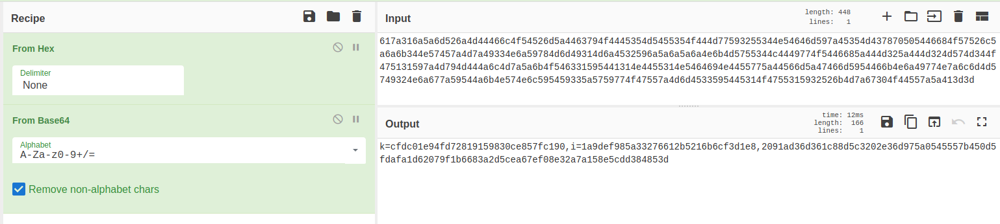
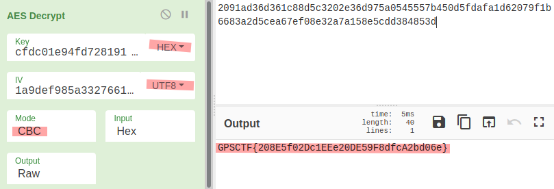

# Twisting seA (200 points)

Decipher this string!

```text
617a316a5a6d526a4d44466c4f54526d5a4463794f4445354d5455354f444d77593255344e54646d597a45354d437870505446684f57526c5a6a6b344e57457a4d7a49334e6a59784d6d49314d6a4532596a5a6a5a6a4e6b4d5755344c4449774f5446685a444d325a444d324d574d344f475131597a4d794d444a6c4d7a5a6b4f546331595441314e4455314e5464694e4455775a44566d5a47466d5954466b4e6a49774e7a6c6d4d5749324e6a677a59544a6b4e574e6c595459335a5759774f47557a4d6d4533595445314f4755315932526b4d7a67304f44557a5a413d3d
```

## Writeup

1. By using `Cyberchef` to decode this string (`From Hex` -> `From Base64`), it returns the following :

    

    ie,

    ```text
    key=cfdc01e94fd72819159830ce857fc190,
    iv=1a9def985a33276612b5216b6cf3d1e8,
    cipher=2091ad36d361c88d5c3202e36d975a0545557b450d5fdafa1d62079f1b6683a2d5cea67ef08e32a7a158e5cdd384853d
    ```

2. From the variable name of the string value above, we know that this encryption requires a __16-byte__ key, plus that the title of this challenge is `Twisting seA`, which the reverse be `Aes`. Thus, we can recognize that this challenge is targetting AES-128 encryption algorithm. For an AES-128 en/decryption, it requires 3 parameters :

    - 16-byte secret key,
    - Initial Vector (IV, MUST be same length as the key), and
    - Ciphertext (multiple of 16-byte).

    

3. As the image shown above, the target AES-128 algorithm used has the key & input cipher in **hexadecimal** and IV in **UTF-8**, then we can decrypt the ciphertext with **CBC** block cipher mode to retrieve the flag.

### Flag

1. **GPSCTF{208E5f02Dc1EEe20DE59F8dfcA2bd06e}**

### References

- [Cyberchef - The Cyber Swiss Army Knife](https://gchq.github.io/CyberChef/)
- [Wikipedia - About AES](https://en.wikipedia.org/wiki/Advanced_Encryption_Standard)
- [Wikipedia - About CBC block cipher mode](https://en.wikipedia.org/wiki/Block_cipher_mode_of_operation#Cipher_block_chaining_(CBC))