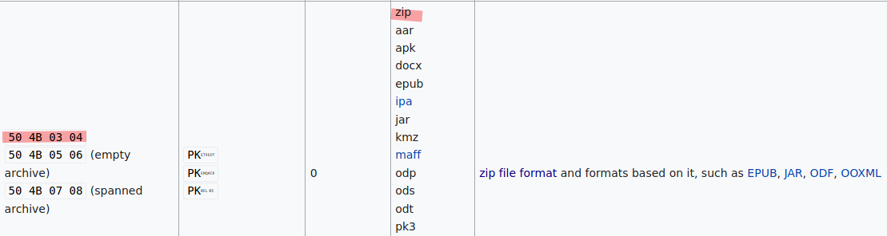
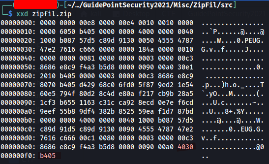
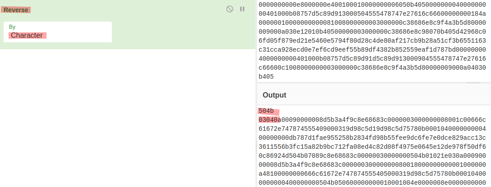

# ZipFil (300 Points)

There's something wrong with this file.

## Writeup

1. By referencing Wikipedia, we know that ZIP extension file has the file signature `50 4B 03 04` in most of the time. However, the ZIP file given was unable to open with any archieve manager, and also the hexadecimal of the given file doesn't satisfy the file signature, but in the reversed form at the end of the hex. Thus, we can assume that the hex of the given file has been reversed.

    
    

2. By using `xxd` CLI tool, we can dump solely the hex of the file with `xxd -ps <FILE>`, then reverse it with Cyberchef and save it in text file `hex.txt`

    

3. We can create the original ZIP file with `xxd` again, by using command `xxd -r- p hex.txt > original.zip`, which dump the plain hexadecimal value stored in the `hex.txt` to the new ZIP file.
4. By using `fcrackzip` tool and wordlist `rockyou.txt`, the password of this locked ZIP can be cracked.
5. You should able to unlock the ZIP, that consists of a text file with the flag inside.

### Flag

1. **StormCTF{Misc2:B73dba52ceDA4dDccb31Ec1b1cDa24Ff}**

### References

- [The structure of a PKZip file](https://users.cs.jmu.edu/buchhofp/forensics/formats/pkzip.html)
- [Wikipedia - List of File Signatures](https://en.wikipedia.org/wiki/List_of_file_signatures)
- [xxd(1) - Linux man page](https://linux.die.net/man/1/xxd)
- [CyberChef - The Cyber Swiss Army Knife](https://gchq.github.io/CyberChef/)
- [Fcrackzip - a Free/Fast Zip Password Cracker](http://manpages.ubuntu.com/manpages/trusty/man1/fcrackzip.1.html)