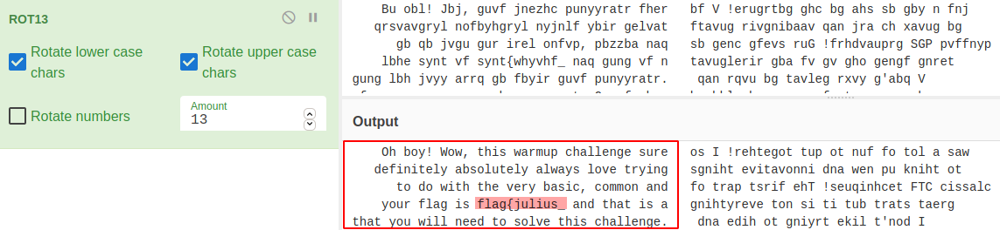
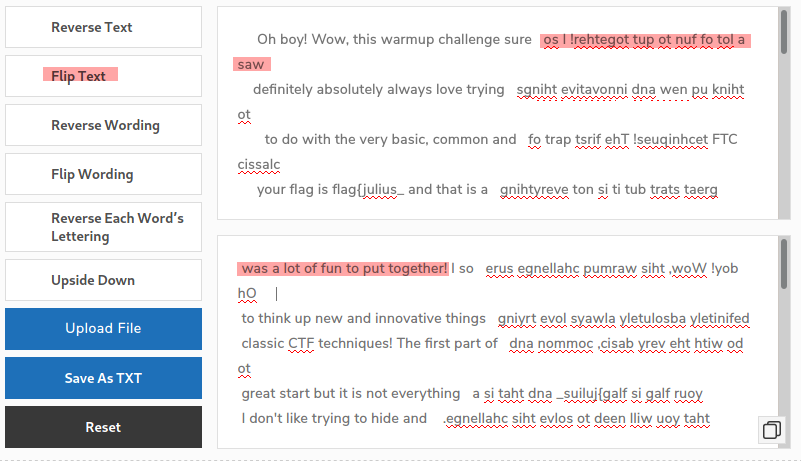
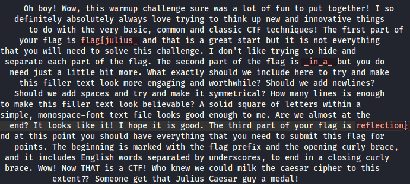

# CaesarMirror

Caesar caesar, on the wall, who is the fairest of them all?

## Difficulty

Easy (50 points)

## Writeup

1. The first thing came to mind when heard about Caesar, is definitely Caesar cipher (ie. rotation-based cipher, ROT). Thus, we can recover the readable text with ROT13 on [cyberchef](https://gchq.github.io/CyberChef/), that we can see the left partition is now english-readable (also 1st part of the flag)

    

2. Since this challenge has the name `mirror`, hence we can expect that the right part is flipped horizontally. By using any online flip text generator, we now should be able to get the right partition of the text readable

    

3. Finally, we just need to combine the both english-readable partition horizontally, then we should be able to get each part of the flag in this challenge.

    

### Flag

**flag{julius_in_a_reflection}**

### References

- [Cyberchef - A web app for encryption, encoding, compression and data analysis](https://gchq.github.io/CyberChef/)
- [Small SEO Tools - Reverse/Flip Text Generator](https://smallseotools.com/reverse-text-generator/)