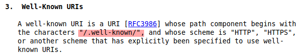
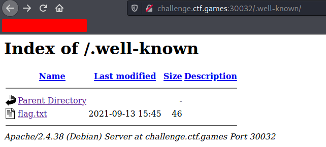

# Common Place

```text
asd7138: can you find the flag here?
tcm3137: no, i dont see it
jwh8163: i cant find it either
rfc5785: i found it
asd7138: what!? where?!
jwh8163: tell us!
```

## Difficulty

Easy (50 points)

## Writeup

1. By searching on the term `rfc5785`, it is an internet standard documentation that defines well-known uniform resource identifiers (URIs). This memo defines a path prefix for "well-known locations", in selected Uniform Resource Identifier (URI) schemes

    

2. After applying the path `.well-known`, we should find out the contents in this directory, ie. the `flag.txt` file

    

### Flag

**flag{rfc5785_defines_yet_another_common_place}**

### References

- [RFC-5785 : Well-Known URIs
](https://www.rfc-editor.org/rfc/rfc5785.html#section-3)