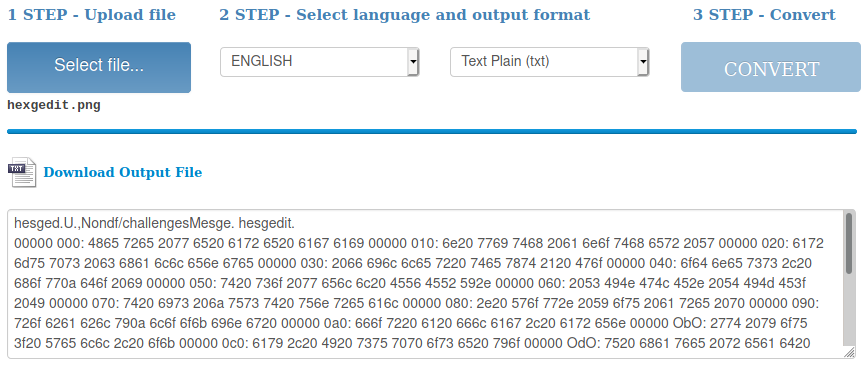
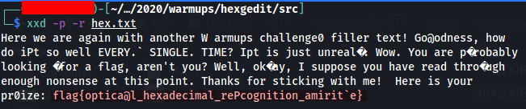

# Hexgedit

Woah! Someone opened the flag file in hexedit... and then gedit?? 

## Difficulty

Easy (50 points)

## Writeup

1. By using some free online [OCR](https://en.wikipedia.org/wiki/Optical_character_recognition) (Optical Character Recognition) service to convert those hex in the image into a string, then correct the result to match exactly the hex value on the given image.

    

2. We can decrypt this hexadecimal with CLI tool command `xxd -p -r hex.txt`, that return the following text

    

### Flag

**flag{optical_hexadecimal_recognition_amirite}**

### References

- [Wikipedia - About OCR](https://en.wikipedia.org/wiki/Optical_character_recognition)
- [Free Online OCR Service](https://www.onlineocr.net/)