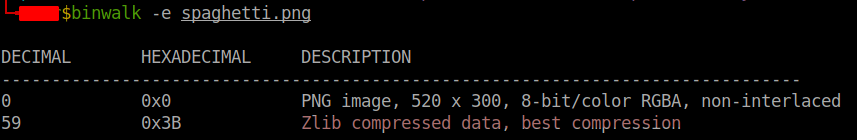
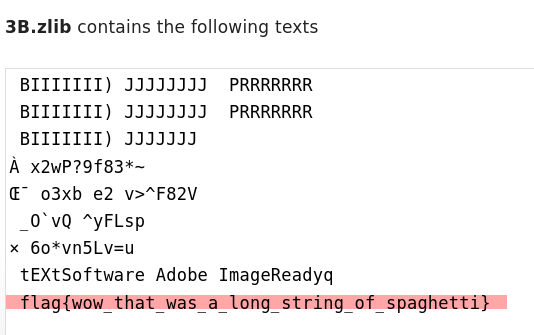

# Spaghetti

It's a classic, it's everyones favorite, it's spaghetti! The long noodles are the best! 

## Difficulty

Easy (50 points)

## Writeup

1. By using `binwalk` program, we can detect and extract the hidden zlib file within the given PNG image file.

    

2. We read the flag hide within the zlib file, by using an online [zlib text reader](https://filext.com/file-extension/ZLIB)

    

### Flag

**flag{wow_that_was_a_long_string_of_spaghetti}**

### References

- [GitHub - About Binwalk](https://github.com/ReFirmLabs/binwalk)
- [About Filext](https://filext.com/file-extension/ZLIB)
