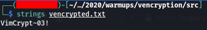
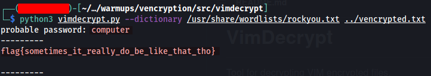

# Vencryption

I know the flag is in this file! I just cannot open it for some reason...

## Difficulty

Easy (50 points)

## Writeup

1. By using `strings` CLI tool, we can see the file signature `VimCrypt~03!`, which indicates that this given file is encrypted with the service from Vim

    

2. Thus, we can crack the password of this encrypted text file by using wordlist `rockyou.txt` and `vimdecrypt` written by `nlitsme`, that returns the following

    

### Flag

**flag{sometimes_it_really_do_be_like_that_tho}**

### References

- [GitHub - vimdecrypt by nlitsme](https://github.com/nlitsme/vimdecrypt)