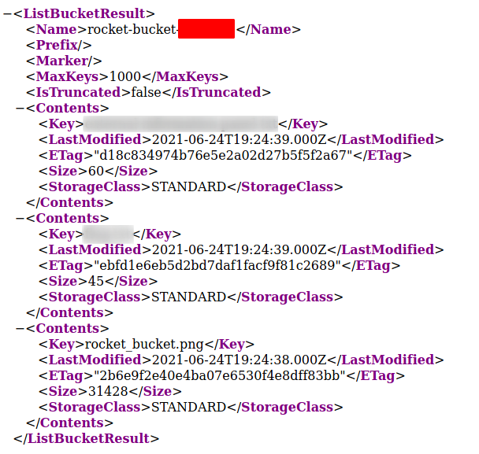
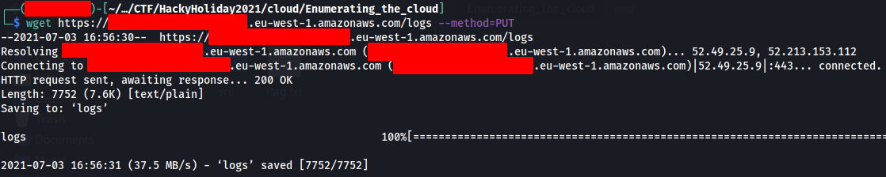
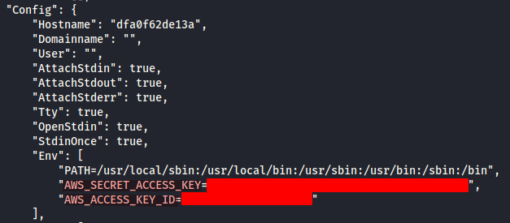
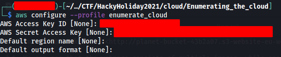
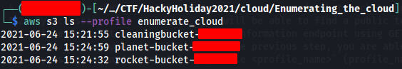
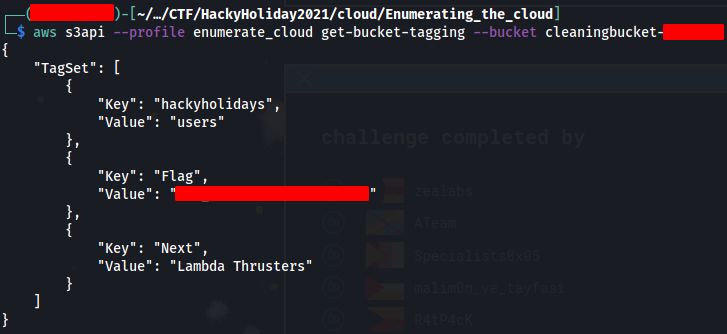
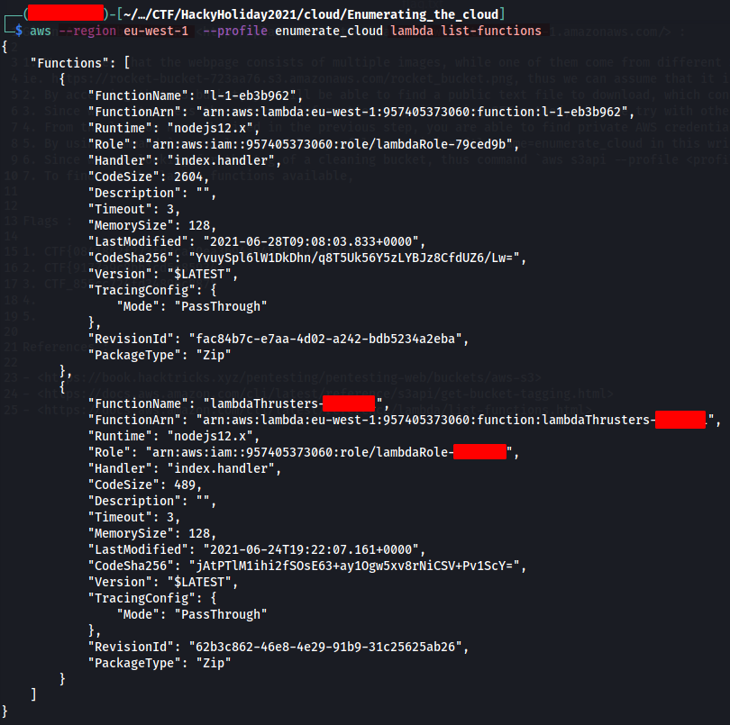
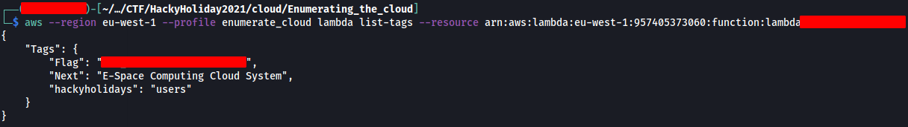
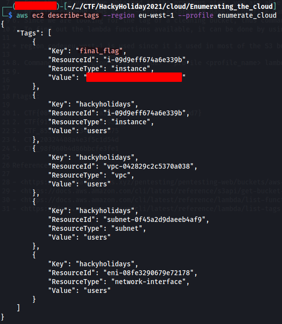

# Enumerating the cloud

The spaceship that you will use in SPACE RACE is almost ready. One of the last steps is to verify that all of the systems are operational. Unfortunately, the AI controlling the system information decided to take a personal time off for a few days, leaving you without an easy access to the spaceship systems. This is not a problem because, as the cyber security specialist in the ship, you know the spaceship cloud infrastructure like the back of your hand.

## Categories

cloud

## Write Up

Given AWS S3 bucket URL <http://planet-bucket-43b2a07.s3-website-eu-west-1.amazonaws.com/> :

1. We can see that the webpage consists of multiple images, while one of them come from different S3 bucket,
ie. https://rocket-bucket-723aa76.s3.amazonaws.com/rocket_bucket.png, thus we can assume that it is a public bucket since it allows cross-reference
2. By accessing that S3 bucket, you will be able to find a public text file to download, which contains the 1st flag.

    

3. Since we can't access the external information endpoint using GET method, thus we try with other HTTP method through `wget --method=HTTPmethod` command, and `PUT` method is successful. That is where you find the 2nd flag.

    

4. From the log you have obtained in the previous step, you are able to find private AWS credentials, which can be used to create an access profile

    

    

5. By using command `aws s3 ls --profile <profile_name>` (profile_name=enumerate_cloud in this writeup), you are able to find out all the S3 bucket this profile has access to.

    

6. Since we are looking for the tag of a cleaning bucket, thus command `aws s3api --profile <profile_name> get-bucket-tagging --bucket <bucket_name>` is used with a tagset that contains 3 key-value pairs, including the 3rd flag

    

7. To find out the lambda functions available, it can be done by using command `aws --region eu-west-1 --profile enumerate_cloud lambda list-functions`, that provide full details about each function.

    

__Note__ : `region_code=eu-west-1` is used since it is used in most of the S3 bucket endpoints in this challenge, eg. <g0341x75tb.execute-api.eu-west-1.amazonaws.com>

8. Command `aws --region <region_code> --profile <profile_name> lambda list-tags --resource <FunctionArn>` allows us to view the tagging of the lambda function, that has the given FunctionArn value

    

9.  Finally, we have to figure out what the 'E-space Cloud Computing System' refers to, in order to find the right tagging. Since EC2 is the most popular computing service on AWS, thus we use command `aws ec2 describe-tags --region <region_code> --profile <profile_name>` to list out the tagging of each EC2 instances, and that is where we can find our final flag.

    

### Flags

1. CTF{0841862f273fd2ca20ea3b94a645781071ab19d7}
2. CTF{9177a9c8bb1cd5c85934}
3. CTF_855cc724fd34896c8875
4. CTF_20324408a4e3f5c1d54d
5. CTF_98f960b4d86bbcfe3fe1

### References

- <https://book.hacktricks.xyz/pentesting/pentesting-web/buckets/aws-s3> [5]
- <https://docs.aws.amazon.com/cli/latest/reference/s3api/get-bucket-tagging.html> [6]
- <https://docs.aws.amazon.com/cli/latest/reference/lambda/list-functions.html> [7]
- <https://docs.aws.amazon.com/cli/latest/reference/lambda/list-tags.html> [8]
- <https://docs.aws.amazon.com/cli/latest/reference/ec2/describe-tags.html> [9]
