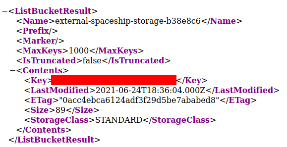
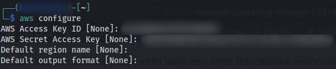
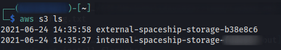
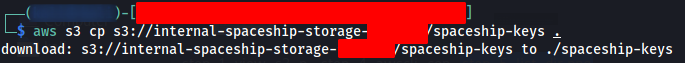

# Locked Out

## Categories

cloud

## Challenge Information

After a relaxing space walk, you realize that you have been locked out of your spaceship by the spaceship's AI. Thankfully, you remember that you prepared for this eventuality by storing access keys in an external storage.

Also see our webinar on cloud security [part 1](https://youtu.be/J7_m-Xmdkxs) and [part 2](https://youtu.be/MKZ74wy3Sf8) for a primer on cloud security and hacking.

## Task 1 - Obtaining external access keys (25 points)

### Description

Open the [external storage](https://external-spaceship-storage-b38e8c6.s3-eu-west-1.amazonaws.com/) and see if there is something useful in there.

### Write Up

1. By launch the only given URL, and you will see a public content available on the listing, ie. _external-spaceship-storage.txt_

    

2. Launch the URL <https://external-spaceship-storage-b38e8c6.s3-eu-west-1.amazonaws.com/external-spaceship-storage.txt> to download this text file
3. In this text file, you are able to find the Access Key ID, Secret Access Key, and the first flag

## Task 2 - Checking your internal storage (25 points)

1. Download [awscli](https://aws.amazon.com/cli/) and launch the command `aws configure`, to authenticate by providing those information mentioned above

    

2. Command `aws s3 ls` lists all the directories on the corresponding authorized S3 bucket, and you will see a private directory that wasn't found on step 1. You should be able to find a file in it, which contain the 2nd flag

    

3. Command `aws s3 cp <source> <target>` allows you to download/copy the file from S3 bucket (requires prefix s3://FULL_PATH) to local machine

    

## Flags

1. CTF{6c2c45330a85b126f551}
2. CTF{4ababede5580d9a22a2a}

## References

- <https://medium.com/@shamnad.p.s/how-to-create-an-s3-bucket-and-aws-access-key-id-and-secret-access-key-for-accessing-it-5653b6e54337>
- <https://docs.aws.amazon.com/cli/latest/userguide/cli-services-s3-commands.html>