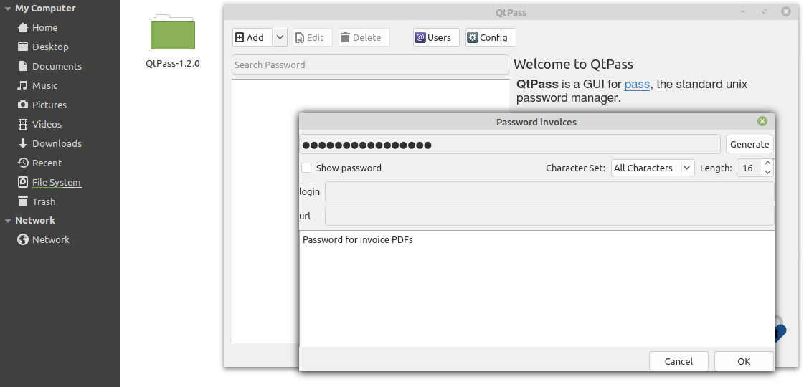
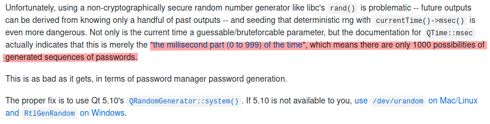
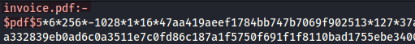
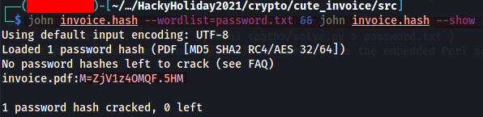
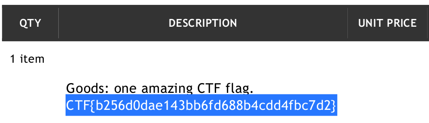

# Cute Invoice

Who knew invoices could be cute?

## Given Files

1. invoice.pdf
2. invoice.png

## Task 1 - Cute Invoice (200 points)

Who knew invoices could be secure AND cute? Our third-party contractor for space shuttle parts is using the best tooling for sending us secure invoices.

1. From the given `invoice` PNG file, we can observe the following :

	- QtPass version 1.2.0 was used as the password manager that generate the password for the `invoice` PDF file
	- The password has 16-character length, with all characters possibly used (brute-force not ideal with common, large wordlist such as `rockyou`)

	

2. By referencing to the algorithm bug of QtPass v1.2.0 (or lower) published on [GitHub](https://github.com/IJHack/QtPass/issues/338), we can generate a short password list (about 1000 entries) for password cracking, based on the given C++ code on the GitHub issue. (see Python3 script `generate_wordlist.py` in `src` directory, ie. command `python3 <path>/solve.py > password.txt`)

	

3. Before starting the password cracking with `John The Ripper` (download [here](https://github.com/openwall/john)) we need to use the embedded Perl script `pdf2john.pl` to extract the hash of the locked PDF file, ie. `<path>/pdf2john.pl <path>/invoice.pdf > invoice.hash`

	

4. Then we can start cracking that PDF hash with the passwordlist generated, ie. command `john <path>/invoice.hash --wordlist=password.txt && john <path>/invoice.hash --show`

	- `john <path>/invoice.hash --wordlist=password.txt` : Hash cracking command
	- `&&` : Continue the execution of the next command if no error returned
	- `john <path>/invoice.hash --show` : Return the corresponding plaintext if the cracking is successful

	

5. We should be able to get the password **M=ZjV1z4OMQF.5HM** after the hash cracking, and unlock the PDF file in order to get the flag

	

## Flags

1. CTF{b256d0dae143bb6fd688b4cdd4fbc7d2}

## References

- [About QtPass - A multi-platform GUI for pass, the standard unix password manager](https://github.com/IJHack/QtPass)
- [About the random generator minstd_rand on C++](http://www.cplusplus.com/reference/random/minstd_rand/)
- [About John The Ripper - An Open Source password security auditing and password recovery tool](https://www.openwall.com/john/)
- [PDF writeup by AusCryptor82 on GitHub](https://github.com/AusCryptor82/Hacky-Holidays-Writeups/blob/main/Cute%20Invoice.pdf)