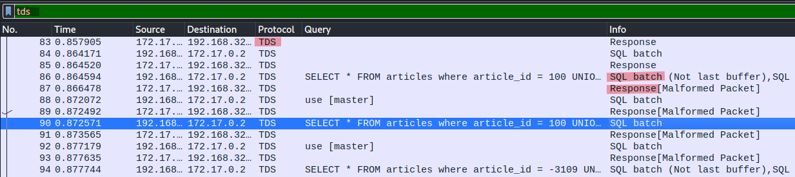
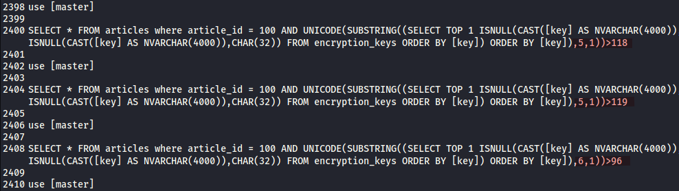

# Injection Traffic

Help us run forensics on this database exploit…

## Categories

network

## Write-Up

We observed malicious traffic towards our database server originating from the web server. Can you find out the sensitive piece of information that was stolen? Flag format: **CTF{32-hex}**

### Prerequisites

- TDS is a network protocol used by Microsoft Server for communication
- When there is a SQL query (shown as `SQL batch` on `Info` column) sent to this server, it will comes with a corresponding `response` packet through the same protocol (ie. TDS)
- To detect an automated injection attack, we can expect that the `Response` packet will be malformed, or return false message. Thus, there should be 2 to 3 different type of response packets

### Steps

1. On Wireshark, we can use the filtering value `tds` to view all the network traffic transferred with TDS protocol, and we can see the pattern mentioned above (ie. 1 SQL batch packet got a corresponding Response packet)

	

2. We use `tshark` to extract all the SQL queries on the traffic that result in malformed `Response` packets, with command `tshark -r traffic.pcap -T fields -e tds.query`, and redirect output to an empty file for further analysis (see tds_queries.txt` file in `src` directory).

 | Option      | Description                                                              |
 | ----------- | ------------------------------------------------------------------------ |
 | `-r <file>` | Read the content of the input file                                       |
 | `-T`        | The format of the text output                                            |
 | `-e`        | Protocol field to output when the option `T` format `fields` is selected |

3. From the extraction with `tshark`, we can see that it is launching the SQL injection attack. Plus, we are able to see that there are certain part of this injection attack is trying to find out the right character of the key in form of ASCII code. If the payload refers to the correct letter, the server will return the Response with size __200__, else it will be some of other size. Then, the payload will move to the next index, eg. the given image below shows that the letter at index `5` is greater than `129` be `True`, then move to the next index `6` afterward.

	

4. Hence, we can use Python library `Pyshark` to automate this process to get the full flag (See `solve.py` in directory `src`). The Python3 program can be executed by using command `python3 <path_to>/solve.py`

## Flag

1. CTF{896fba9098ac85533fcd7bbb182f5690}

## References

- [What is TDS protocol ?](https://sqlserverperformace.blogspot.com/2021/04/speaking-to-sql-server-sniffing-tds.html)
- [Malformed Packet on Wireshark](https://www.wireshark.org/docs/wsug_html_chunked/AppMessages.html#:~:text=Malformed%20packet%20means%20that%20the,known%20TCP%20or%20UDP%20port.)
- [Wireshark : What is not last buffer ?](https://osqa-ask.wireshark.org/questions/33755/what-is-not-last-buffer/)
- [Microsoft SQL Server : master database](https://docs.microsoft.com/en-us/sql/relational-databases/databases/master-database)
- [About Tshark : CLI Network Packet Analyzer](https://www.wireshark.org/docs/man-pages/tshark.html)
- [About PyShark](https://github.com/KimiNewt/pyshark)
