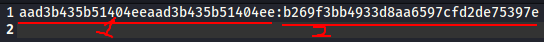

# Scorching

Windows domains are hot. Scorching even. Note: a domain controller is spun up on-demand. It may take a while to fully boot upon launch. Verify whether it's online by checking if port 445 is open on <10.6.0.2>.

**NOTE** : The private _OpenVPN_ configuration file is required

## Writeup

### Task 1 - Password (75 points)

Can you find out the password for the hash in the file? It is the account for the "NAccount" user.

**Hint**: The password does not meet the password complexity policy as it is _less than 8 characters and only includes letters and numbers.

Given an unknown hash, and the intel that this password is formed with less than 8 characters and only includes letters and numbers_.

1. According to ref[1], it seems that this hash is likely to be a NTLM hash because of the first part of the hash gives `aad3b435b51404eeaad3b435b51404ee`, which means that it is not being stored as an LM hash. Also, NTLM is a hashing algorithm created by Microsoft, which is appropriate to this challenge

	

2. Thus, mask attack with hashcat was used to crack the 2nd part (ie. LMhash:NThash) of the given hash (stored in text file `ntlm.txt`), and command `hashcat -a3 -m1000 -O -1 ?l?u?d ntlm.txt ?1?1?1?1?1?1?1 --increment -v` is used to launch the definied mask attack with hashcat, which

	- `-a3` : Mask attack code
	- `-m1000` : Hash type code
	- `-1 ?l?u?d` : First custom charset option, see [ref](https://hashcat.net/wiki/doku.php?id=mask_attack) for more details
	- `ntlm.txt` : Hash file that contains the hash to be cracked here
	- `?1?1?1?1?1?1?1` : Mask to be used in final increment
	- `--increment` : Enable incremental masking attack, which the cracking will start from ?1 to ?1?1 to ?1?1?1 to ... to ?1?1?1?1?1?1?1 (end)

	

3. You should be able to see the password in plaintext when the NThash is cracked, ie. `NAccount:H4cky21`

### Task 2 - Scorching (100 points)

Can you find out the flag hidden in the shared directory for the "SAccount" user?
Hint: the password is part of rockyou.txt.

0. Given the recon with `nmap` toward the target url, we can see that the port `445` with common vulnerable (cuz of `smb`) service `microsoft-ds`  version `2012 R2` is open

	

	

1. Although now we have the credential of `NAccount:H4cky21`, however we need to access the shared directory as user `SAccount`, which is not accessible by NAccount. So first we can start from finding accessible and non-accessible directories with command `smbmap -u "NAccount" -p "<password>" -H 10.6.0.2`

	

2. Since the task name `scorching` has a synonym `roasting`, thus we can deduce that it is related to `Kerberoasting attack` (see [here](https://book.hacktricks.xyz/windows/active-directory-methodology/kerberoast) to know more)
3. By using the Python script [GetUserSPNs.py](https://github.com/SecureAuthCorp/impacket/blob/master/examples/GetUserSPNs.py) from [Impacket](https://github.com/SecureAuthCorp/impacket), which allows us to find Service Principal Names (SPNs) that are associated with normal user account, we are able to find the **Keberos** hash of user `SAccount` with command `python3 <path>/GetUserSPNs.py -request -dc-ip <IP_ADDRESS> <DOMAIN.FULL>/<USERNAME>:<PASSWORD>`

| Option                | Description                                                                                      |
| --------------------- | ------------------------------------------------------------------------------------------------ |
| `-request`            | Requests TGS (Ticket-Granting Service) for users and output them in JohnTheRipper/hashcat format |
| `-dc-ip <IP_ADDRESS>` | IP address of the Domain Controller, ie. `10.6.0.2` here                                         |
| <DOMAIN.FULL>         | insecureAD.local                                                                                 |

ie.  `python3 <path>/GetUserSPNs.py insecureAD.local/NAccount:<password> -dc-ip 10.6.0.2 -request`

**NOTE** : Use command `locate <FILE_NAME>` to find if the Python script can be found on your Linux system, or it may be required to clone the `Impacket` repo to and set it up in order to run the script.

4. After copy the entire Keberos hash returned to file `kerberos_dump.hash`, we can use JohnTheRipper or Hashcat to crack this hash, with wordlist `rockyou.txt` (available [here](https://github.com/brannondorsey/naive-hashcat/releases/download/data/rockyou.txt) or `/usr/share/wordlists` directory on Kali)

- JohnTheRipper command `john kerberos_dump.hash --wordlist=<path_to_rockyou> && john kerberos_dump.hash --show`
- Hashcat command `hashcat64 -a 0 -m 13100 kerberos_dump.hash <path_to_rockyou>`

	

5. After cracking the Keberos hash (password should be `MySpaceXXX`), we are able to access those shared directories as user `SAccount` now, and we can see that the directory `SpaceRace` is *readable* with this account. Thus, the flag file on this directory should be readable too.

	

## Flags

1. H4cky21
2. CTF{Kerberoasting_Flag_SpaceRace}

## References

- [SecretsDump Demystified](https://medium.com/@benichmt1/secretsdump-demystified-bfd0f933dd9b)
- [Intro to Windows Hashes](https://chryzsh.gitbooks.io/darthsidious/content/getting-started/intro-to-windows-hashes.html)
- [About Hashcat](https://hashcat.net/hashcat/)
- [Mask Attack with Hashcat](https://hashcat.net/wiki/doku.php?id=mask_attack)
- [SANS : SMB Access From Linux](https://assets.contentstack.io/v3/assets/blt36c2e63521272fdc/blta6a2ae64ec0ed535/5eb08aaeead3926127b4df44/SMB-Access-from-Linux.pdf)
- [Abput Kerberoast Attack](https://book.hacktricks.xyz/windows/active-directory-methodology/kerberoast)
- [Impacket : a collection of Python classes for working with network protocols](https://github.com/SecureAuthCorp/impacket)
- [Wikipedia - Keberos](https://en.wikipedia.org/wiki/Kerberos_(protocol))
- [A little guide to SMB enumeration](https://www.hackingarticles.in/a-little-guide-to-smb-enumeration/)
- [Brute Force Service Cheat Sheet](https://book.hacktricks.xyz/brute-force)
- [About Hashcat](https://hashcat.net/hashcat/)
- [About John The Ripper](https://www.openwall.com/john/)