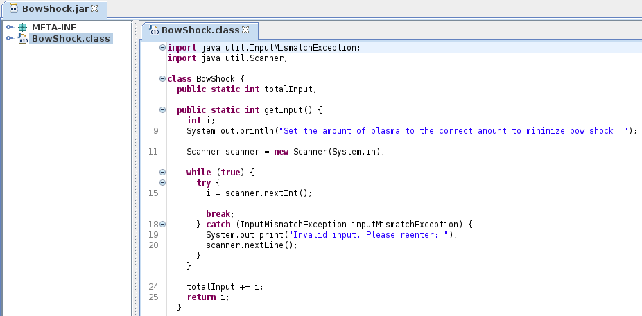
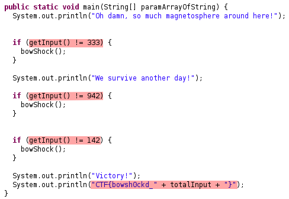

# BowShock

Bow shock is an amazing phenomenon, but you better not get too close…

## Category

reversing

## Task 1 - BowShock

### Description

Can you find out how to minimize bow shock and prevent everything from turning into dust?

### Write Up

1. Download [jd-gui](http://java-decompiler.github.io) which is one of the best Java decompiler for beginners.
2. By opening/decompiling the JAR file with jd-gui, it allows us to view the source code of the given JAR file easily, and our target is the only `BowShock.class`

    

3. Referring to the `main` method, it shows the requirement of int input with value 333, 942 and 142, in strict ordering to survive the BowShock game

    

4. Since `int totalInput = 333 + 942 + 42 = 1417`, thus we can get the final flag even without running the JAR file. Otherwise, we can also run this JAR program with command `java -jar <JAR_FULL_FILENAME>`, and enter those 3 integers in the correct order.

## Flag

- CTF{bowsh0ckd_1417}
