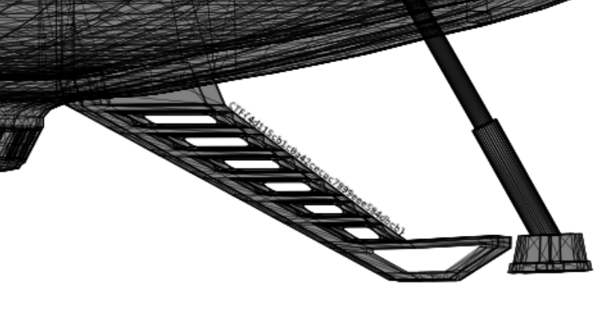
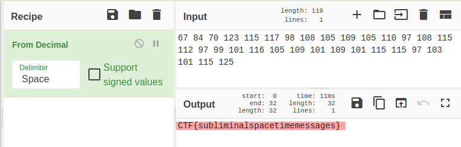

# Unidentified Graphics Object

We've seen an Unidentified Graphic Object for advertising a new space ship. It was created with one of the universe's most advanced design tools that can store information alongside the image in different dimensions.

## Writeup

### Task 1 - Subliminal advertising (75 points)

The agency who created the space ship has included some subliminal advertising. Can you find out what their secret message is? Flag format: `CTF{hex}`

1. By using command line tool `apngdis`, we are able to disassemble the APNG file into corresponding frame as PNG files (ie. `apngdis ugo.apng`)
2. After looking into all 61 PNG images, it turns out the 60th and 61th seem the same, while we can find that the 1st flag is zoom out from the space ship stair

    

### Task 2 - Spacetime (75 points)

This new image format also features spacetime support to embed information using time into the 4-dimensional manifold. Flag format: `CTF{...}`

1. Group all the text file content extracted from the APNG file with command `cat *.txt > delay.txt`
2. Remove all duplicate strings `delay=95/1000` , `delay=`, `/1000`, and new line characters with any text editor available
3. Decode the remaining decimals with `Cyberchef` and it will give us the 2nd flag

    

## Flags

1. CTF{4d115cb1c0a42cecac7899eee584dbcb}
2. CTF{subliminal_spacetime_messages} / CTF{subliminalspacetimemessages} (Unable to verify since it was solved after the flag submission is **disabled**)

## References

- [apngdis - deconstruct APNG file into a sequence of PNG frames](http://manpages.ubuntu.com/manpages/bionic/man1/apngdis.1.html)
- [Markdown writeup from Team J'Hack Chirac's Neurchak](https://ctftime.org/writeup/29386)
- [Video writeup from Cryptocat on Youtube](https://www.youtube.com/watch?v=u1Sh5TZN5Ug&t=923s)
- [Cyberchef - The Cyber Swiss Army Knife](https://gchq.github.io/CyberChef/)