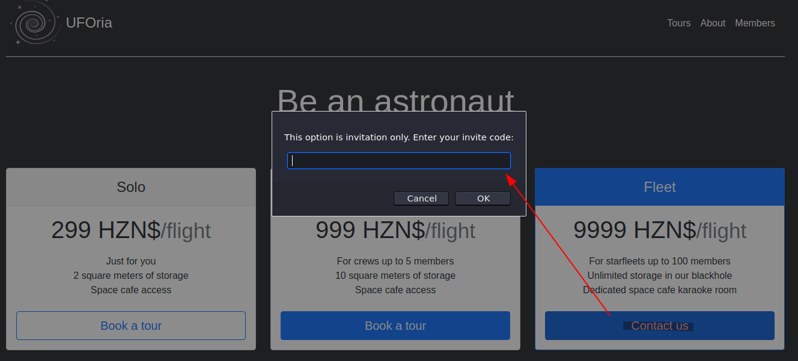

# UFOria

UFOria specializes in organizing your trip to space. Get some tickets while they last!

## Category

web, osint

## Task 1 - Invite only (75 points)

Can you get a valid invite code? The flag is the invite code.

### Write Up

Given the website URL (randomly generated), the navigation of webpages are controlled by the parameter `page` :

```text
|- /?page=landing 	(homepage)
|- /?page=about		(description about UFOira Aerospace)
|- /?page=members 	(login form to access member-only page)
|- /?page=forgot	(POST form to retrieve existing user's password)
|- /?page=karaoke	(HTTP error code 500)
```

1. To find out the correct invitation code for the input box, we first look into the source code of this homepage (ie. `/?page=landing`)

    

    

2. We can find out that the invitation code is validated by an in-file JS function (look for `<script>` tag) called `contactus()`
3. Reverse engineering the `contactus()` JS function to get the invitation code (Testing the understanding of JavaScript basic built-in function)

    ```text
    Requirements :

    - length = 12 characters
    - Separated into 3 ordered parts, that is concatenated with character '-'
    - 1st part : "UFO"
    - 2nd part : btoa("UFO") = "VUZP"
    - 3rd part : "UFO".charCodeAt(0) + "UFO".charCodeAt(1) + "UFO".charCodeAt(2) = "234"

    -> 1st flag : UFO-VUZP-234
    ```

## Task 2 - Members only

Can you access the members-only area?

### Write Up

1. To access the __member-only__ section, we have to pass through the authentication on page `/?page=members`, but since we don't know the credential, we start the testing on page `/?page=forgot` which requires only the username. It allows us to verify if the username exists in the database

    

2. To find the possible username, we start the searching on the page `/?page=about` which consist 2 possible candidates, Ben Organa and Elliot Talton,and also a bracket `borgana`. It turns out to be one of the existing username in the database, and now we need to find the answer of the security question -> borgana's birthplace

    

    

3. Since we know borgana has the same birthplace as Elliot Talton in the `about` page, thus by using Google and LinkedIn searches, we can confirm that all the employees in UFOria Aerospace are :

   - Ben Organa (aka borgana), CEO
   - Elliot Talton , Co-founder <https://www.linkedin.com/in/elliot-talton/>
   - Mark Reddy, Sales Attendant <https://www.linkedin.com/in/mark-reddy-9a61a220a/>
   - Mary Smith, Student <https://www.linkedin.com/in/mary-smith-022787216/detail/recent-activity/>

**Note** : It requires the tester to signing their LinkedIn account, in order to view the profile right away with those URLs

4. There are 2 posts on Elliot's LinkedIn account, which the latest post shows a hint regarding their childhood memories in somewhere called `'s Lands Huys Cafe`, and the location of this place hould be helpful to find out their birth place.

    

5. By searching with Google, we can see that this cafe is located in Bourtange, Netherland. Thus, `Bourtange` should be the correct answer for the security question.

    

6. The password for account `borgana` should be able to be retrieved after input the answer for the security password, hence now you should be able to access `member-only` page with this set of credential, and the last flag will be returned after login successfully.

    

    

## Flags

1. UFO-VUZP-234
2. CTF{fataborgana42}
